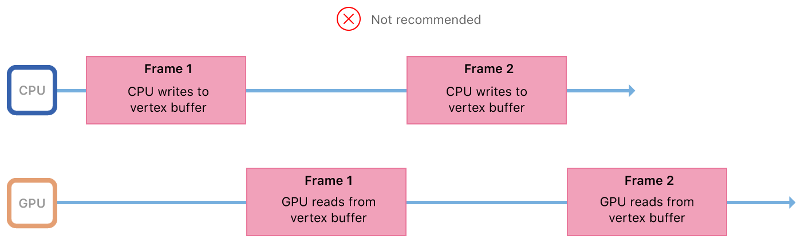
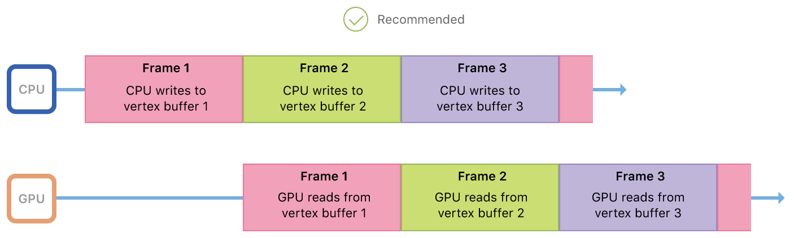

# CPU and GPU Synchronization

Demonstrates how to update buffer data and synchronize access between the CPU and GPU.

## Overview

In this sample you'll learn how to properly update and render animated resources that are shared between the CPU and the graphics processing unit (GPU). In particular, you'll learn how to modify data each frame, avoid data access hazards, and execute CPU and GPU work in parallel.

## CPU/GPU Parallelism and Shared Resource Access

The CPU and GPU are separate, asynchronous processors. In a Metal app or game, the CPU encodes commands and the GPU executes commands. This sequence is repeated in every frame, and a full frame's work is completed when both the CPU and the GPU have finished their work. The CPU and the GPU can work in parallel and don't need to wait for each other to finish their work. For example, the GPU can execute commands for frame 1 while the CPU encodes commands for frame 2.

This CPU/GPU parallelism has great advantages for your Metal app or game, effectively enabling you to run on two processors at once. However, these processors still work together and usually access the same shared resources, such as vertex buffers or fragment textures. Shared resource access must be handled with care; otherwise, the CPU and GPU might access a shared resource at the same time, resulting in a race condition and corrupted data.

This sample, like most Metal apps or games, renders animated content by updating vertex data in each frame. Consider the following sequence:

1. The render loop starts a new frame.
2. The CPU writes new vertex data into the vertex buffer.
3. The CPU encodes render commands and commits a command buffer.
4. The GPU begins executing the command buffer.
5. The GPU reads vertex data from the vertex buffer.
6. The GPU renders pixels to a drawable.
7. The render loop completes the frame.

In this sequence, the CPU and GPU both share a single vertex buffer. If the processors wait for each other to finish their work before beginning their own work, there are no access conflicts for the shared vertex buffer. This model avoids access conflicts, but wastes valuable processing time: when one processor is working, the other is idle.



Metal is designed to maximize CPU and GPU parallelism, so these processors should be kept busy and should be working simultaneously. Ideally, the GPU should be reading vertex data for frame 1 while the CPU is writing vertex data for frame 2. However, sharing a single vertex buffer means that the CPU could overwrite the previous frame's vertex data before the GPU has read it, resulting in unsightly rendering artifacts.


To reduce processor idle time and avoid access conflicts, vertex data can be shared by using multiple buffers instead of a single buffer. For example, the CPU and GPU can share vertex buffer 1 for frame 1, vertex buffer 2 for frame 2, vertex buffer 3 for frame 3, and so on. In this model,  shared vertex data stays consistent throughout each frame and the processors access different vertex buffers simultaneously.



## Implement a Triple Buffer Model

This sample renders hundreds of small quads, also known as *sprites*. To animate the sprites, the sample updates their positions at the start of each frame and writes them into a vertex buffer. When a frame is complete, the CPU and GPU no longer need the vertex buffer for that frame. Discarding a used vertex buffer and creating a new one for each frame is wasteful. Instead, a more sustainable model can be implemented with a FIFO queue of reusable vertex buffers.

The maximum number of buffers in the queue is defined by the value of `MaxBuffersInFlight`, set to 3. This constant value defines the maximum number of frames that can be worked on simultaneously by any part of the device; this includes the app, the driver, or the display. The app only works on a frame in the CPU or the GPU, but the OS itself may work on a frame at the driver or display level. Using three buffers gives the device enough leeway to work efficiently and effectively. Too few buffers can result in processor stalls and resource contention, whereas too many buffers can result in increased memory overhead and frame latency.

``` objective-c
for(NSUInteger bufferIndex = 0; bufferIndex < MaxBuffersInFlight; bufferIndex++)
{
    _vertexBuffers[bufferIndex] = [_device newBufferWithLength:spriteVertexBufferSize
                                                       options:MTLResourceStorageModeShared];
}
```

At the start of the `drawInMTKView:` render loop, the sample iterates through each of the buffers in the `_vertexBuffer` array, updating only one buffer per frame. At the end of every third frame, after all three buffers have been used, the sample cycles back to the start of the array and updates the contents of the `_vertexBuffer[0]` buffer.

## Manage the Rate of Work

To avoid overwriting data prematurely, the sample must ensure that the GPU has processed the contents of a buffer before reusing it. Otherwise, the CPU could overwrite the vertex data that was written three frames earlier but has not been read by the GPU yet. This condition occurs when the CPU produces work for the GPU faster than the GPU can complete it.  

This sample uses semaphores to wait for full frame completions in case the CPU is running too far ahead of the GPU.

``` objective-c
_inFlightSemaphore = dispatch_semaphore_create(MaxBuffersInFlight);
```

At the start of the render loop, the semaphore checks for a proceed or wait signal. If a buffer can be used or reused, the CPU work proceeds; otherwise, it waits until a buffer is available.

``` objective-c
dispatch_semaphore_wait(_inFlightSemaphore, DISPATCH_TIME_FOREVER);
```

The GPU can't signal the semaphore directly, but it can issue a completion callback to the CPU.

``` objective-c
[commandBuffer addCompletedHandler:^(id<MTLCommandBuffer> buffer)
{
    dispatch_semaphore_signal(block_sema);
}];
```

The `addCompletedHandler:` method registers a block of code that that is called immediately after the GPU has finished executing a command buffer. This command buffer is the same one that committed a vertex buffer for a frame, so receiving the completion callback indicates that the vertex buffer can be safely reused.
